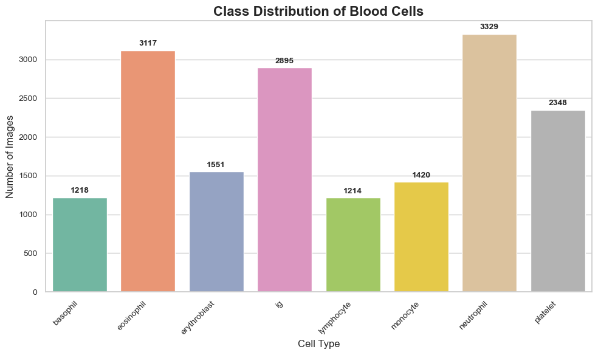
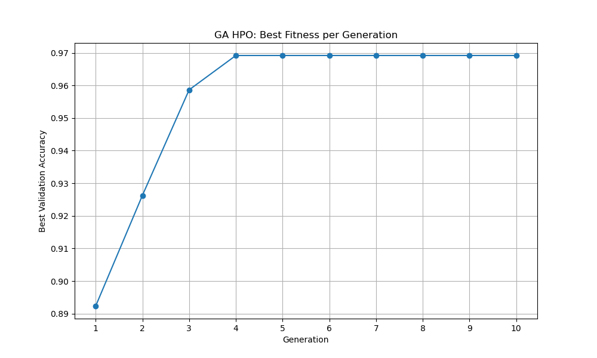

# Evolving Optimal Neural Networks via a Genetic Algorithm for Medical Image Classification

## 1. Executive Summary

This report documents the end-to-end development of an advanced machine learning system designed to classify medical images of blood cells with high accuracy. The core innovation of this project is the utilization of a custom-built **Genetic Algorithm (GA)** to automate the complex and critical process of **Hyperparameter Optimization (HPO)**. Instead of relying on manual tuning or standard grid search, this project evolves an optimal **Convolutional Neural Network (CNN)** architecture and its corresponding training parameters.

The resulting system not only achieves a **test set accuracy of 97.15%** but also demonstrates a **robust, modular, and scalable MLOps pipeline**. The project culminated in the deployment of the final evolved model as an **interactive web application using Streamlit**, providing a tangible and accessible demonstration of its capabilities.

**Keywords**: Genetic Algorithm, Hyperparameter Optimization, Neural Architecture Search, Deep Learning, MLOps, PyTorch, Streamlit, Medical Image Classification.

---

## 2. Problem Statement & Dataset

**Objective**:  
To develop a highly accurate deep learning model for classifying blood cell images into eight distinct categories:  
`basophil`, `eosinophil`, `erythroblast`, `ig`, `lymphocyte`, `monocyte`, `neutrophil`, and `platelet`.

**Dataset**:  
This project uses a publicly available dataset containing 17,092 microscopic images of blood cells. The dataset provides a diverse collection of blood cell images ideal for classification tasks.

You can access the dataset here:
Blood Cells Image Dataset on [Kaggle](https://www.kaggle.com/datasets/unclesamulus/blood-cells-image-dataset/data)

### Exploratory Data Analysis (EDA) Summary

- **Class Imbalance**:  
  The dataset exhibits a moderate class imbalance (see Figure 1), with `neutrophil` and `eosinophil` being the most represented classes, and `lymphocyte` and `basophil` the least.  
- **Image Statistics**:  
  All images were resized to **224x224 pixels**.  
  Mean: `[0.875, 0.749, 0.721]`  
  Standard Deviation: `[0.158, 0.185, 0.079]`
- **Data Split** (with fixed random seed):
  - Training Set: 11,964 images (70%)
  - Validation Set: 2,563 images (15%)
  - Test Set: 2,565 images (15%)

  
   
  <em><b>Figure 1:</b> Class distribution of the blood cell dataset.</em>

---

## 3. Methodology & System Architecture

The project was structured as a modular pipeline, with each component designed for clarity, reusability, and robustness.

**Tech Stack**:
- **Core Libraries**: PyTorch, NumPy, Pandas, Scikit-learn  
- **Visualization**: Matplotlib, Streamlit  
- **Development Tools**: Python 3.13, Miniconda, VS Code  

### 3.1. Dynamic CNN Model (`cnn_model.py`)

A key architectural decision was to create a `DynamicCNN` class capable of constructing a unique CNN architecture on-the-fly from a dictionary of hyperparameters.

- **Dynamic Convolutional Blocks**:  
  The number of Conv2D → BatchNorm → Activation → MaxPool blocks (`num_conv_blocks`) was a hyperparameter.
- **Dynamic Fully-Connected Layers**:  
  Number and size of dense layers were part of the GA search space.
- **Flexible Activations & Dropout**:  
  Activation function (ReLU, ELU, LeakyReLU) and dropout rate were genes.

---

### 3.2. The Genetic Algorithm for HPO (`genetic_algorithm.py`)

From-scratch implementation of a **Genetic Algorithm**.

- **Genetic Representation (Genes)**:  
  Each individual = dictionary of CNN hyperparameters.
- **Fitness Function (`train_evaluate.py`)**:  
  Individuals were trained for 10 epochs. Validation accuracy = fitness score.

#### Evolutionary Operators

- **Selection**: Tournament Selection  
- **Crossover**: Uniform crossover of hyperparameters  
- **Mutation**: 15% mutation rate for diversity  
- **Elitism**: Top 2 individuals carried to next generation

---

### 3.3. Engineering for a Long-Duration Experiment

- **Checkpointing**:  
  Entire GA state (population, RNG states, fitness history) saved to `ga_checkpoint.pth`
- **Resume Capability**:  
  Auto-detect and resume from checkpoint  
- **PyTorch Compatibility**:  
  Fixed `torch.load(..., weights_only=True)` flag issue for PyTorch 2.6+

---

## 4. Results & Analysis

The GA was run for **10 generations** with a **population of 10 individuals**. Final model was trained for **50 epochs**.

### 4.1. GA Convergence and Performance

  
   
  <em><b>Figure 2:</b> Best validation accuracy (fitness) per generation.</em>

- **Rapid Discovery**: From 89.2% → 96.9% in just 4 generations  
- **Convergence**: Plateau from generation 4 indicates search space optimization

---

### 4.2. Analysis of the Evolved Optimal Hyperparameters

| **Hyperparameter**      | **Value Evolved** | **Analysis & Insight** |
|-------------------------|-------------------|-------------------------|
| Optimizer               | adam              | Adaptive and stable for CV tasks |
| Learning Rate           | 0.00021           | Stable, non-default LR discovered |
| Batch Size              | 16                | Smaller size improved generalization |
| Architecture            | 4 Conv Blocks     | Deepest allowed architecture selected |
| Filters (Start)         | 32                | Final layer had 256 filters |
| Activation (Conv)       | elu               | Avoids "dying ReLU" problem |
| Dropout Rate            | 0.0               | Data augmentation sufficient, dropout unneeded |

---

### 4.3. Final Model Evaluation

- **Validation Accuracy**: 97.78%  
- **Test Accuracy**: 97.15%  
- **Generalization**: Small gap between validation and test proves robustness

---

## 5. Deployment as an Interactive Application (`app.py`)

Deployed as a fully containerized **Streamlit** application using **Docker**, ensuring portability, consistency, and ease of deployment across different environments.

- **Functionality**:  
  Upload image → Preprocessing → Model inference → Cell type prediction.
- **UI Features**:  
  Displays image, prediction, confidence score, and class-wise bar chart.
- **Impact**:  
  Demonstrates the complete lifecycle from model training to a scalable, user facing application, with Docker enabling streamlined deployment and environment management.

---

## 6. Conclusion & Key Takeaways

This project demonstrates that a **Genetic Algorithm** can effectively automate both **hyperparameter optimization** and **neural architecture search**.

### Key Takeaways

- **Automation Unlocks Performance**:  
  GA found high-performing, non-obvious configurations
- **Robust Engineering is Essential**:  
  Checkpointing and modularity made long experiments possible
- **Lifecycle Completion Matters**:  
  From data to deployment, a complete ML workflow

---
